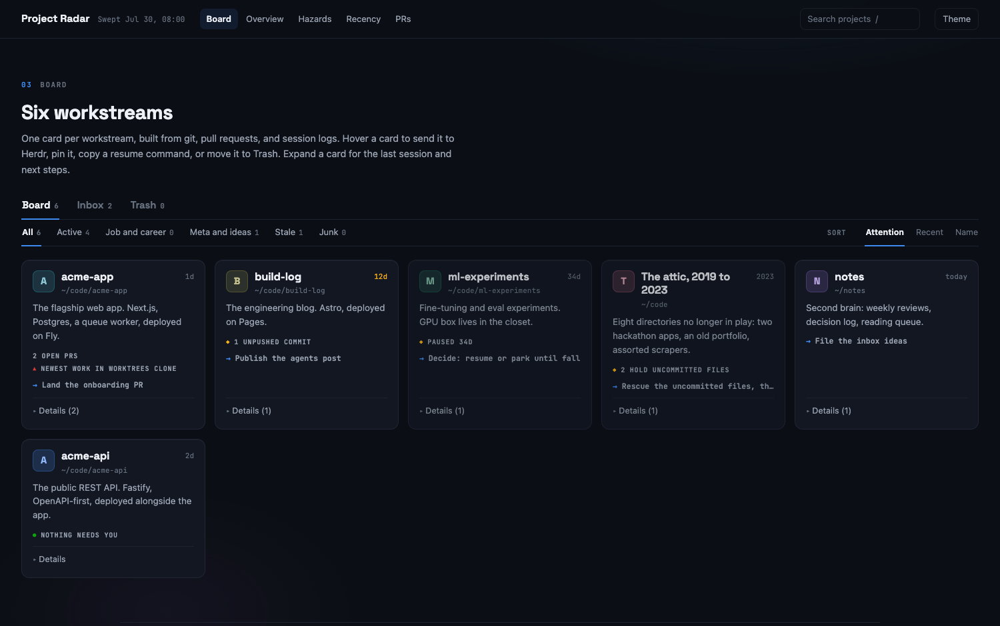

# Mission Control

A self-updating project radar for solo devs running too many projects at once.

One board, generated from ground truth — your git checkouts, open pull requests,
Claude Code session logs, and a spoken-idea inbox — because any board you have to
maintain by hand will rot in a week.



## What it does

- **Sweeps, you don't type.** `sweep.js` scans every checkout under your roots:
  freshness, dirty files, unpushed commits, satellite clones that silently hold
  your newest work. It pulls your open PRs (`gh`), your latest Claude Code
  session per project, and open issues from an inbox repo. Then it regenerates
  the board, a terminal `BOARD.md`, and `data.json`.
- **A board you want to look at.** One card per workstream with an identity hue,
  freshness, hazard flags, last session and next steps. Views for Overview,
  Hazards (where work goes missing), Recency and PRs. Board, Inbox and Trash
  tabs; pin, search, sort; deletions are tombstones that survive regeneration.
- **Hands, not just eyes.** Hover a card, hit the ram, and the local server opens
  a [herdr](https://herdr.dev) workspace for that project, starts Claude in a
  fresh pane, and hands it a prompt built from the card: where the project
  stands and what its next steps are. Live dots on the cards show each
  workspace's agent state (working / blocked / done).
- **It updates as work happens.** A Claude Code `SessionEnd` hook (the scribe)
  records what each session did; the server notices, re-sweeps, and any open
  board refreshes. There is also a daily scheduled sweep and a Sweep button.
- **Ideas from your wrist.** An Apple Watch Shortcut posts dictated ideas as
  GitHub issues into a private inbox repo; they appear in the board's Inbox tab.
  See [docs/watch-inbox.md](docs/watch-inbox.md).

## How it works

Three thin layers over data you already produce:

1. **Observe** — `sweep.js` reads git/gh/session-log truth and rewrites only the
   marker-delimited regions of `board.html`. Everything else on the page
   (styling, interactions, your hand-written notes) is left alone.
2. **Intend** — `scribe.js` runs on Claude Code's `SessionEnd` hook and writes
   `status/<project>.json`: the session's prompts, files touched, a summary.
   The sweeper folds that into the cards; the server treats it as a "work
   happened" signal.
3. **Act** — `server.js` (loopback only) serves the board and exposes
   `/api/sweep` and `/api/launch`. Launch drives the herdr socket API:
   workspace (create if missing) → new tab → `claude` → prompt.

## Install

Needs: macOS, Node 18+, `git`, [`gh`](https://cli.github.com) (authed).
Optional: [`herdr`](https://herdr.dev) for card launches, an Apple Watch for the
inbox.

```sh
git clone https://github.com/Tatendaz/mission-control
cd mission-control
cp config.example.json config.json     # then edit: roots, projects, paths
cp board.template.html board.html
node sweep.js                          # first sweep — board.html goes live
node server.js                         # http://localhost:8765
```

Edit `config.json` to describe your world:

| key | what |
|---|---|
| `roots` | directories scanned for git checkouts (depth 3) |
| `satelliteRoots` | places where duplicate/fleet clones live; matched to projects by remote |
| `projects` | the registry: one entry per card. `id` is permanent (pins and tombstones key on it) |
| `ghOwner`, `inboxRepo` | your GitHub user and the private repo your watch posts ideas into |
| `sweepHour`/`sweepMinute` | daily sweep time |
| `herdr`, `terminalApp` | launch integration; delete `terminalApp` to skip window focusing |

A project entry: `{ "id": "app", "name": "acme-app", "path": "~/code/acme-app",
"label": "acme-app", "cat": "active", "git": true, "next": ["..."] }` — `label`
must match the herdr workspace label (usually the directory name). Non-git
workstreams use `"git": false` and get freshness from session logs. Aggregate
cards (`"aggregate": true` + `members`) roll up a shelf of stale directories.

### Keep it alive + in the Dock

Run the server under launchd so it survives reboots and sweeps on schedule
(edit the paths):

```xml
<!-- ~/Library/LaunchAgents/com.you.mission-control.plist -->
<?xml version="1.0" encoding="UTF-8"?>
<!DOCTYPE plist PUBLIC "-//Apple//DTD PLIST 1.0//EN" "http://www.apple.com/DTDs/PropertyList-1.0.dtd">
<plist version="1.0"><dict>
  <key>Label</key><string>com.you.mission-control</string>
  <key>ProgramArguments</key><array>
    <string>/opt/homebrew/bin/node</string>
    <string>/Users/you/mission-control/server.js</string>
  </array>
  <key>WorkingDirectory</key><string>/Users/you/mission-control</string>
  <key>RunAtLoad</key><true/><key>KeepAlive</key><true/>
  <key>EnvironmentVariables</key><dict>
    <key>PATH</key><string>/opt/homebrew/bin:/usr/bin:/bin</string>
  </dict>
</dict></plist>
```

```sh
launchctl bootstrap gui/$(id -u) ~/Library/LaunchAgents/com.you.mission-control.plist
sh app/build-app.sh        # assembles "Mission Control.app" with the radar icon
open -R "app/Mission Control.app"   # drag it to the Dock
```

The Dock app checks the server, starts it if needed, and opens the board as its
own Chrome app window (or your default browser).

### The scribe hook

Add to `~/.claude/settings.json` (merge into any existing hooks):

```json
{ "hooks": { "SessionEnd": [ { "matcher": "*", "hooks": [
  { "type": "command", "command": "node /Users/you/mission-control/scribe.js", "timeout": 20 }
] } ] } }
```

### A `/standup` skill (optional)

Drop a skill that runs `node .../sweep.js`, reads `BOARD.md`, and briefs you:
hazards first, then a suggested focus, then the inbox. Ten lines of markdown in
`~/.claude/skills/standup/SKILL.md` — shape it how you like.

## Security notes

- The server binds `127.0.0.1` only. `/api/launch` executes commands, so never
  re-bind it to a reachable interface.
- The watch inbox token should be a fine-grained PAT scoped to the single
  private inbox repo with Issues read/write only — a leaked token can then do
  nothing but file ideas at you.
- `config.json`, `board.html`, `status/` and friends are gitignored: they are
  your data, not the tool.

## Not affiliated

herdr integration drives the public `herdr` CLI; this project is not affiliated
with or endorsed by the herdr team. Works fine without herdr — you just lose
the ram button.

MIT.
