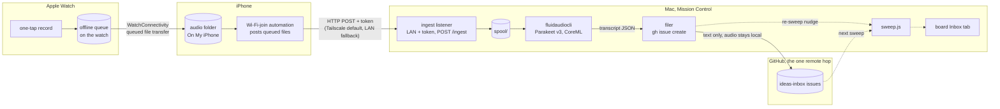

# Voice inbox v2: record anywhere, transcribe on your Mac

**Status: roadmap item, accepted design, not built.** This replaces the dictation
path in [watch-inbox.md](watch-inbox.md) when it ships; the v1 Shortcut keeps
working until then and its doc stays.

## Why v1 is not enough

v1 turns speech into text on the watch, at capture time, using Apple's dictation
stack. Two failures showed up in daily use:

- **The text is wrong too often.** Watch dictation runs on the SFSpeechRecognizer
  lineage, benchmarked at [9.0% word error rate on clean speech and 16.3% on
  noisy](https://get-inscribe.com/blog/apple-speech-api-benchmark.html)
  (LibriSpeech). The model this design runs on the Mac, Parakeet TDT v3 under
  CoreML, measures [2.5% on the same clean
  corpus](https://github.com/FluidInference/FluidAudio/blob/main/Documentation/Benchmarks.md).
  Project names come out mangled; half the inbox needs retyping, which defeats an
  idea inbox.
- **There is no offline queue.** The v1 doc says it itself: "capture needs the
  phone nearby or watch connectivity." Ideas that arrive on a run die on the
  wrist.

So v2 stops transcribing at capture time. Capture becomes dumb audio plus a
queue; every workflow survey we did found that dictation-at-capture pipelines
break offline and record-audio pipelines survive. All intelligence moves to the
Mac that already runs Mission Control.

## Ethos

Everything local except the one hop that is the point: filing the issue.

1. Audio is captured and stored **on the watch or phone**, offline-first.
2. Audio moves to the Mac **over the local network**, or through a WireGuard
   tunnel encrypted end to end between phone and Mac. No iCloud, and no server
   anywhere that can read a byte of it: Tailscale relays, when a direct path
   fails, forward only ciphertext.
3. Transcription runs **on the Mac**, on models stored on disk.
4. Only the **transcript and its capture metadata** (recorded-at, duration,
   confidence, source device) leave the machine, as a GitHub issue in the
   private inbox repo. The audio itself never does.

## Architecture



Six legs. Three are new code, one is a purchase, two already exist.

### 1. Capture: Just Press Record (phase 1 buys, phase 2 builds)

[Just Press Record](https://www.openplanetsoftware.com/just-press-record/)
($6.99, one-time) is the capture surface for phase 1:

- Records on the watch **with no iPhone present**, unlimited length, keeps
  recording with the wrist down, starts from a one-tap complication or Siri.
- Queued recordings auto-transfer to the iPhone over WatchConnectivity, not
  iCloud.
- With iCloud storage switched **off**, recordings live in a plain,
  date-organized folder under On My iPhone, visible to the Files app and to
  Shortcuts. That folder is the handoff point.
- Its own transcription stays disabled; we only want the .m4a files.

Why not the obvious free option, Apple Voice Memos: its cross-device path is
iCloud only (not end-to-end encrypted unless the whole account opts into
Advanced Data Protection), its on-Mac store is a Group Container that is unsafe
to touch (titles live in `CloudRecordings.db`, and writing into the folder can
corrupt iCloud sync state), and no Shortcuts action can export a recording's
audio. It remains the documented fallback for people who already accept iCloud.

One honest caveat, straight from [Apple DTS on the developer
forums](https://forums.developer.apple.com/forums/thread/758334):
WatchConnectivity transfer timing belongs to the system. The queue persists
across app termination and drains on its own, but on a stubborn day the fix is
opening the JPR watch app once, which flushes it immediately.

### 2. Courier: one Shortcuts automation on the iPhone

One shortcut does the work; automations decide when it runs:

1. Get File(s) from the JPR folder.
2. For each: Get Contents of URL, `POST
   http://&lt;mac-tailnet-ip&gt;:8770/ingest` (the Tailscale address, the
   default transport; on the LAN-HTTP fallback this is the Mac's home-LAN IP
   instead), bearer token header, `Content-Type: audio/mp4`, file as body.
3. On HTTP 200: move the file to a `sent/` subfolder. On a timeout,
   connection failure, 5xx, or 507: leave it in place for the next trigger.
   On any other 4xx (bad token, unsupported type, over `maxUploadMB`): move
   it to a `rejected/` subfolder, visible in Files, so a permanently
   refusable file cannot retry forever. At 100 MB, `maxUploadMB` is hours of
   .m4a, so rejection in practice means misconfiguration, not a long memo.

Triggers, all **Run Immediately** (no confirmation since iOS 17; iOS always
posts a notification banner per run, which doubles as a sync receipt):

- **"When I join &lt;home SSID&gt;"**, the main path.
- **Time-of-day at 21:00**, the nightly sweeper for days the Wi-Fi trigger
  did not fire.
- With the Tailscale transport below, optionally **"When I join any Wi-Fi"**,
  so delivery also happens away from home.

To be precise about what Tailscale does and does not change: it makes the Mac
*reachable* from any network, but it does not make an automation *fire*. Away
from home, files move on the next trigger that actually runs (any-Wi-Fi join
or the 21:00 sweep); until then they wait in the folder. First run prompts
once for the iPhone's local-network permission.

### 3. Listener: a LAN ingest endpoint on the Mac

The main server stays exactly as the README warns: loopback only, because
`/api/launch` executes commands. The ingest listener is a **separate HTTP
server** (own port, default 8770) that Mission Control's server starts, and it
speaks one verb:

- `POST /ingest`, bearer token required. The token is minted once at setup
  (32 random bytes, stored in `config.json`, pasted once into the Shortcut).
- Accepted `Content-Type`s: `audio/mp4`, `audio/x-m4a`, `audio/m4a`,
  `audio/wav`, `audio/mpeg`, or `application/octet-stream`. The header only
  gates entry; **every** upload is container-sniffed (`ftyp`, `RIFF`, MP3
  sync) before spooling, and a body that does not match a known audio
  container is 415 regardless of its declared type. Per request,
  `maxUploadMB` (default 100); in total, a spool quota of `maxSpoolMB`
  (default 2048) or 200 files, whichever hits first, with `failed/` counting
  toward it; over quota it answers 507 and the courier retries on a later
  trigger. Writes go to exactly one place: `inbox-audio/spool/` with a
  server-generated name (`YYYYMMDD-HHMMSS-<sha8>.m4a`). Client filenames are
  recorded as metadata, never used as paths.
- The recording's identity is its full SHA-256, and the claim is the gate to
  publication: the listener streams the upload into a temp file while
  hashing, then creates `claims/<sha256>` (`O_EXCL`), then renames the temp
  file into `spool/`. Two concurrent uploads of the same recording race on
  the claim, not on the spool: the loser's `O_EXCL` fails, its temp file is
  deleted, and it is acknowledged with 200 like any duplicate, so nothing
  double-stores or double-counts the quota. On startup the listener sweeps
  leftover temp files and reclaims claims with no backing spool, archive, or
  failed file (the crash-between-claim-and-rename case), so no crash can
  wedge a recording.
- No exec, no reads, no other routes. A leaked token buys an attacker the
  ability to feed audio into the pipeline, and the pipeline bounds what that
  is worth: the listener rate-limits to 60 requests per hour per token, the
  worker transcribes one file at a time, and the filer stops at
  `maxIssuesPerDay` (default 50), after which recordings stay spooled and
  the hazard chip fires. So the worst case is junk issues in the private
  inbox repo and a wedged intake until you clean up: delete the junk issues,
  clear the spool, rotate the token (re-mint, re-paste into the Shortcut).
  That temporary denial of intake is an accepted risk; what is not at risk:
  the worker treats every transcript as untrusted text, the board already
  escapes issue-derived strings at both render layers, and the token cannot
  launch, read, or reach anything else.

**Transport, in order of preference.** The default is
[Tailscale](https://tailscale.com/kb/1232/derp-servers): the Shortcut posts to
the Mac's tailnet IP, the transfer is WireGuard-encrypted end to end (even
relayed DERP traffic is unreadable to the relay), it works from any network,
and the bearer token never crosses a wire in the clear. The no-dependency
fallback is plain HTTP on the home LAN, and it is a real tradeoff, stated
plainly: anyone sniffing that LAN can read the token and the audio in transit.
The token's blast radius stays spool-junk (above), but on a shared or
untrusted LAN the fallback is the wrong choice. HTTPS with a self-signed
certificate is not offered because Shortcuts' Get Contents of URL cannot be
told to trust one; Tailscale is the encryption story.

### 4. Transcriber: FluidAudio on the models you already have

[FluidAudio](https://github.com/FluidInference/FluidAudio) (Apache-2.0, macOS
14+, Apple Silicon) is the engine that the FluidVoice dictation app embeds. Its
CLI does batch files:

```sh
git clone -b v0.15.5 https://github.com/FluidInference/FluidAudio && cd FluidAudio
swift build -c release --product fluidaudiocli
install -m 755 .build/release/fluidaudiocli ~/.local/bin/   # where config's `cli` points

fluidaudiocli transcribe spool/20260731-071502-a1b2c3d4.m4a \
  --model-version v3 --language en \
  --custom-vocab "$HOME/Library/Application Support/FluidVoice/parakeet_custom_vocabulary.json" \
  --output-json out.json
```

The clone pins the release tag the worker was tested against; bumps are a
deliberate config-and-retest step, not a drive-by.

The facts that make it the right engine here:

- **.m4a decodes natively** (anything AVAudioFile reads; auto-resampled to
  16 kHz mono). No ffmpeg leg.
- **Models are shared with FluidVoice.** Both default to
  `~/Library/Application Support/FluidAudio/Models/parakeet-tdt-0.6b-v3-coreml`;
  if FluidVoice is installed the 483 MB download already happened, and
  `--model-dir` pins it explicitly. Without FluidVoice, first run downloads
  once.
- **The custom vocabulary carries over.** FluidVoice's
  `parakeet_custom_vocabulary.json` uses the exact schema `--custom-vocab`
  accepts, so every project name taught to the dictation app (herdr, yapui,
  promptups) also boosts memo transcription.
- **Fast enough to be invisible.** Around 190x realtime on an M4 Pro; a
  two-minute memo transcribes in under a second. Long recordings chunk
  automatically with seam repair; files over ~30 s stream from disk.
- Output JSON carries `text`, `confidence`, and word timings; the worker parses
  that, never stdout scraping.

Engines are pluggable behind one contract: the worker normalizes whatever the
engine emits into `{ text, confidence | null, words | null }` and everything
downstream consumes only that. `fluidaudio` fills all three from
`--output-json` (its JSON names the timing array `wordTimings`; the worker's
adapter maps it to `words`). The alternate for machines without Apple Silicon, or with a
macOS 26 SpeechAnalyzer preference, is [`yap`](https://github.com/finnvoor/yap)
(`brew install yap`, no model download): it emits plain text with no
confidence, so `confidence` is `null` and the issue footer prints
`confidence n/a`.

### 5. Filer: the transcript becomes an issue

The worker files into the same `inboxRepo` v1 uses, via the already-authed
`gh`. Setup gains one line over v1: `gh label create voice --repo
<you>/<inbox-repo>`, because `gh issue create --label` fails on a label that
does not exist (the filer also handles that error by creating the label once
and retrying).

```sh
gh issue create --repo <you>/<inbox-repo> --label voice \
  --title "<first eight words of the transcript>" \
  --body  "<full transcript>

  ---
  recorded: 2026-07-31 07:15 · 1m42s · confidence 0.94 · via watch
  audio kept on the Mac 90 days: inbox-audio/archive/20260731-071502-a1b2c3d4.m4a
  id: <full sha-256 of the audio>"
```

Every `failed/` entry carries a sidecar `<name>.error.json` recording the
error and a `retry` flag; the retry pass processes only `retry: true`. An
empty or whitespace-only transcript never becomes an issue: it means silence
or an engine failure, so the recording moves to `failed/` with
`{"error": "empty transcript", "retry": false}` (the same audio would
transcribe empty again) and the hazard chip brings it to a human. Transient
errors (engine crash, `gh` network failure) write `retry: true`.

Three implementation rules are load-bearing here. First, the worker invokes
`gh` through an argument array (`execFile`, no shell): transcripts are spoken
text and will eventually contain quotes, backticks, and dollar signs. Second,
filing is single-writer by construction: one worker process drains the spool
serially, so the `id:` lookup guards crash-retry, not concurrency. Before
creating, the filer searches the inbox repo for any issue, open or closed,
containing the recording's SHA-256 (`gh issue list --state all --search
"<sha256> in:body"`); a crash between issue creation and archiving therefore
cannot produce a duplicate when the file is retried. Third, a lookup that
errors means do-not-create: the file stays spooled for the next pass rather
than risking a duplicate. The metadata footer (recorded-at, duration,
confidence, source device, id) is the full list of what accompanies the
transcript off the machine; the archive path names a file that stays local.

Titles are a truncation heuristic in v2.0; anything smarter must run locally or
not at all (open question below). After filing, audio moves `spool/ →
archive/`, the transcript is kept as a sidecar `.txt` next to it, and the
server gets the same re-sweep nudge a scribe write triggers today. Failures
move to `failed/` with their error sidecar; the ones marked retryable rejoin
the next pass.

Neither holding area grows without bound. `archive/` is pruned on each worker
pass after `archiveRetainDays` (default 90); the issue is the durable record,
the audio is a 90-day safety net for re-transcription. `failed/` is never
auto-pruned, because each entry is a hazard waiting for a human, but it
counts toward the spool quota, so a pile-up of failures backpressures intake
instead of eating the disk.

### 6. Board: nothing to build

The Inbox tab already renders `inboxRepo` issues; voice ideas land there on the
next sweep with no board changes. One addition earns its place: a hazard chip
when the pipeline is silently stuck, because silent sync failure is the
failure mode every prior-art pipeline warned about. Two conditions raise it: a
`spool/` file older than `stuckAfterMinutes` (default 30), or anything in
`failed/` at all, shown with its recorded error.

## The queue, end to end

Record on a phone-free run. JPR holds the audio on the watch. Walking back in
range, WatchConnectivity drains watch → phone on the system's schedule (worst
case: open the watch app once). The files sit in On My iPhone. Arriving home,
the SSID automation fires, posts each file, moves it to `sent/`. The listener
spools, the worker transcribes and files, the board re-sweeps. Every leg
persists across restarts of its device or process; no leg depends on the
previous one having run recently. The 21:00 automation and the `failed/`
retry pass (`retry: true` entries only) sweep up anything the happy path
missed.

## Phases

**Phase 1, buy capture, build the Mac side.** JPR + the Shortcut + listener,
worker, filer inside this repo (`voice.js`, started by `server.js` when
`voiceInbox` exists in config). New code is roughly: one HTTP listener, one
child-process wrapper, one `gh` call, one hazard rule.

**Phase 2, native capture app, only if phase 1 friction is real.** A watchOS +
iOS pair replaces JPR when we want what no bought app provides: a queue-depth
complication (trust at a glance), capture-time intent tags ("issue" vs "note"
vs a project name) and location, WCSession file transfer with our own retry
telemetry, iPhone-side background URLSession uploads (`isDiscretionary=false`,
`allowsCellularAccess=false`, so audio moves on Wi-Fi only and resumes cleanly
after a relaunch) that fire without opening any app, and a Tailscale-first target so
delivery works from anywhere. Known iOS physics phase 2 cannot repeal: uploads
enqueue only while the OS grants background time, and a force-quit of the app
cancels its pending uploads until next launch.

**Phase 2.5, routing.** The first spoken words select the destination:
"issue ..." files to the inbox, a project name files to that project's backlog,
"remind me ..." is left unrouted on purpose (reminders are not ideas). Prefix
routing exists in shipping products (Whisper Memos "Agents") and costs one
string match in the filer.

## Alternatives considered

- **Keep v1 and shout more clearly.** Dictation accuracy is the complaint;
  no Shortcut change fixes the model.
- **Voice Memos + iCloud + folder watch.** Best queue Apple ships, but iCloud
  transit (E2EE only under account-wide ADP), a fragile Group Container, and no
  export API. Documented fallback, not the design.
- **Whisper Memos** ($60/yr). The best watch capture UX in the market and the
  proof the offline-queue model works, but transcription is their cloud, and
  GitHub is reachable only through Zapier. Fails rules 2 and 3 of the ethos.
- **MacWhisper watch folder / `mw` CLI.** A fine Mac-side engine, but paid,
  Whisper-class rather than Parakeet-class on disfluent speech, no model or
  vocabulary sharing with FluidVoice, and it still solves none of the transport.
- **Shortcuts-only capture, no app purchase.** iOS Shortcuts cannot record
  audio headlessly: the Record Audio action is modal and [breaks when invoked
  via Siri](https://developer.apple.com/forums/thread/727391), apps [cannot
  start recording from the
  background](https://developer.apple.com/forums/thread/756507), Voice Memos
  actions cannot export audio, and watchOS Shortcuts cannot record audio at
  all. This is the wall v1 already hit.
- **Syncthing as transport.** iOS clients get 1 to 2 hours of background sync
  per day at unpredictable times; fine as a redundant drain, not as the
  pipeline.

## Config sketch

```json
"voiceInbox": {
  "listenPort": 8770,
  "token": "<minted at setup>",
  "engine": "fluidaudio",
  "cli": "~/.local/bin/fluidaudiocli",
  "modelVersion": "v3",
  "language": "en",
  "customVocab": "~/Library/Application Support/FluidVoice/parakeet_custom_vocabulary.json",
  "maxUploadMB": 100,
  "maxSpoolMB": 2048,
  "maxIssuesPerDay": 50,
  "archiveRetainDays": 90,
  "stuckAfterMinutes": 30
}
```

Path values (`cli`, `customVocab`) accept a leading `~`; the config loader
expands it to the home directory before any `execFile`, which never does that
expansion itself. The install step above is what puts the built binary at the
path `cli` names.

The audio directory is deliberately not configurable: it is always
`inbox-audio/` (spool, archive, failed) inside the Mission Control directory,
instance data and gitignored like `config.json` and `board.html`. A
configurable path would need its own gitignore story; a fixed one is covered
by the shipped `.gitignore` forever.

## Open questions

1. **Titles.** First-eight-words is honest but flat. A local title pass could
   use FluidVoice's bundled MLX sidecar or any local model; a cloud LLM would
   break the ethos for cosmetics. Decide after living with truncation.
2. **Where the worker lives.** In-process in `server.js` versus a `voice.js`
   child the server supervises. Leaning child process: a CoreML crash should
   not take the board down.
3. **Phase 2 trigger.** Define the friction threshold that green-lights the
   custom app (candidate: more than one manual watch-app flush per week, or
   any silent loss of a recording).
